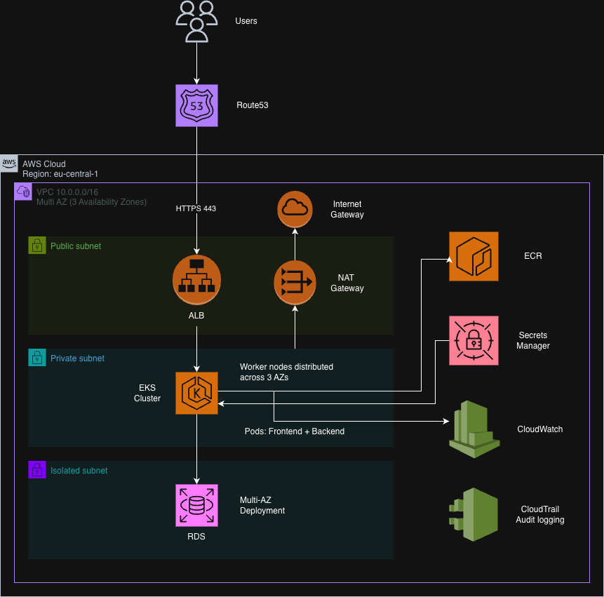
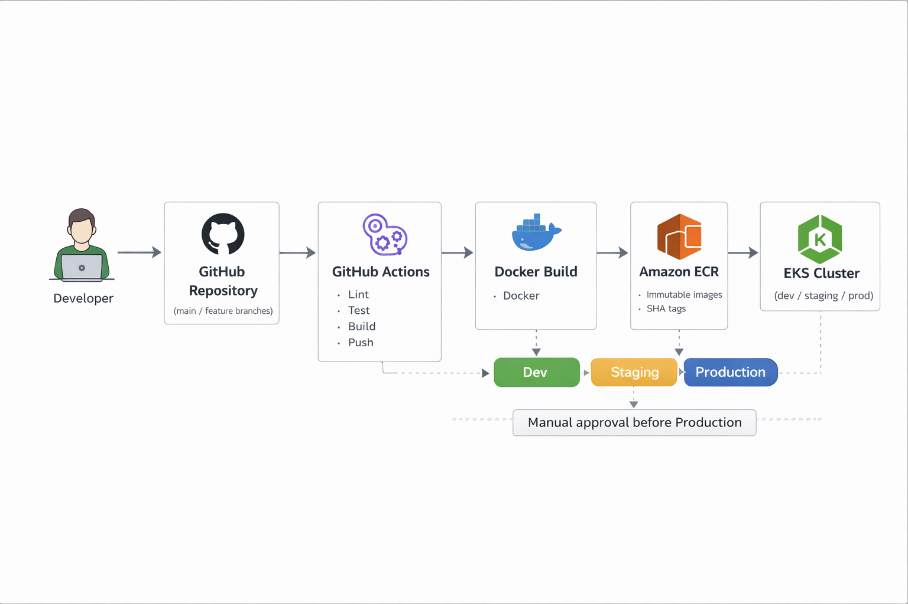

# Innovate Inc. – AWS Cloud Architecture Design

## Executive Summary

Innovate Inc. is building a web application consisting of:

- React Single Page Application (SPA)
- Python (Flask) REST API backend
- PostgreSQL database
- CI/CD-driven deployment model
- Sensitive user data handling

This document proposes a secure, scalable, and cost-efficient AWS architecture using managed Kubernetes (Amazon EKS) and AWS-native services. The design supports:

- Initial low traffic (hundreds of users/day)
- Rapid growth to millions of users
- Strong security and isolation
- Continuous delivery practices
- Operational simplicity for a startup team

---

# High-Level Architecture Diagram

<p align="center">
  
</p>

The diagram above illustrates:

- Multi-AZ VPC design
- Public / Private / Isolated subnet segmentation
- Internet-facing ALB
- EKS cluster with dynamic node scaling
- Multi-AZ RDS PostgreSQL
- Secure integration with ECR, Secrets Manager, CloudWatch, and CloudTrail

---

# Cloud Environment Structure

## AWS Account Strategy

We recommend a **3-account model**:

- **dev** – Development and experimentation
- **staging** – Pre-production validation
- **prod** – Production workloads

### Rationale

- Strong environment isolation
- Reduced blast radius
- Clear billing separation
- Independent IAM boundaries
- Safer production deployments
- Independent upgrade and testing lifecycle

Each account contains its own:

- VPC
- EKS cluster
- RDS database
- IAM configuration
- CI/CD integration

This model balances startup simplicity with production readiness.

---

# Network Design

## VPC Architecture (Per Account)

Each environment contains:

- 1 VPC
- 3 Availability Zones
- Public subnets (ALB only)
- Private subnets (EKS worker nodes)
- Isolated subnets (RDS PostgreSQL)

### Traffic Flow

Users → Route53 → ALB → EKS → RDS

### Internet Access

- Internet Gateway attached to VPC
- NAT Gateway for private subnet outbound traffic
- No public IPs assigned to worker nodes
- RDS not publicly accessible

---

## Network Security

- Security Groups for:
  - ALB (public HTTPS)
  - EKS nodes (internal communication only)
  - RDS (allow traffic only from EKS SG)
- TLS termination at ALB (HTTPS 443)
- Encrypted traffic between services
- Optional AWS WAF in front of ALB
- Optional AWS Shield Advanced for DDoS protection

Production Enhancements:
- VPC Flow Logs
- PrivateLink for internal services
- API endpoint CIDR restrictions

---

# Compute Platform – Amazon EKS

## Why EKS?

- Managed control plane
- Multi-AZ high availability
- Native AWS IAM integration (IRSA)
- Kubernetes ecosystem compatibility
- Simplified operational overhead

---

## Cluster Design

Each environment contains:

- 1 EKS cluster
- Managed control plane
- Worker nodes in private subnets
- IRSA enabled

### Node Strategy

- Minimal on-demand baseline node group
- Karpenter for dynamic scaling
- Spot instances for cost efficiency
- Multi-architecture support:
  - amd64
  - arm64 (Graviton)

---

## Scaling Strategy

### Horizontal Scaling

- Horizontal Pod Autoscaler (HPA)
- CPU/memory-based scaling
- Optional custom metrics

### Node Scaling

- Karpenter provisions nodes dynamically
- Spot-first provisioning strategy
- Node consolidation enabled
- Multi-AZ scheduling

---

## Resource Allocation Strategy

- Defined CPU and memory requests
- Resource limits to prevent noisy neighbors
- Namespaces:
  - frontend
  - backend
  - monitoring
- Pod Disruption Budgets (PDB)

---

# Scalability Evolution Plan

## Phase 1 – Early Stage

- Small instance types
- Single RDS instance (Multi-AZ)
- Minimal baseline capacity
- Auto-scaling enabled

## Phase 2 – Growth

- Increased pod replicas
- PostgreSQL read replica
- ElastiCache (Redis) for caching
- CloudFront for SPA delivery

## Phase 3 – High Scale

- Read replicas across regions
- Advanced autoscaling
- Dedicated monitoring/logging account
- Multi-region disaster recovery strategy

---

# Containerization Strategy

## Image Build

- Docker multi-stage builds
- Optimized backend image
- Static build for React frontend

## Registry

- Amazon ECR (private)
- Image scanning enabled
- Immutable SHA-based tagging

---

# CI/CD Strategy

## CI/CD Flow Diagram

<p align="center">
  
</p>

## Pipeline Stages

```bash
1. Code linting and unit tests
2. Docker build
3. Push image to ECR
4. Deploy to EKS
```

## Environment Promotion Model

- dev → automatic deployment
- staging → automatic deployment
- prod → manual approval required

Versioning:

- Semantic versioning
- Immutable SHA tags
- Rolling updates

---

# Database Design – PostgreSQL

## Service Choice

Amazon RDS PostgreSQL (Multi-AZ)

### Rationale

- Managed backups
- Automated patching
- High availability
- Reduced operational overhead
- Built-in encryption

---

## Backup & Recovery

- Automated daily snapshots
- Point-in-time recovery (PITR)
- Snapshot retention policy
- Optional cross-region copy

---

## High Availability

- Multi-AZ synchronous standby
- Automatic failover
- Optional read replicas for scaling reads

---

# Security Architecture

## IAM Strategy

- Least privilege policies
- Separate IAM roles per environment
- IRSA for pod-level permissions
- Strict production access control

---

## Secrets Management

- AWS Secrets Manager
- Automatic credential rotation
- No plaintext credentials in code

---

## Encryption

- KMS encryption at rest
- TLS for all inbound traffic
- EBS encryption
- RDS encryption enabled

---

## Audit & Logging

- CloudTrail enabled
- ALB access logs
- RDS audit logs
- EKS control plane logging

---

# Observability & Monitoring

## Logging

- CloudWatch Logs
- Centralized application logging
- ALB logs stored in S3

## Metrics

- Prometheus
- Grafana dashboards
- CloudWatch alarms

## Alerts

- Slack / email notifications
- CPU / memory thresholds
- DB connection monitoring
- Error rate monitoring

---

# Cost Optimization Strategy

- Spot instances for workloads
- Graviton for price/performance gains
- Node consolidation
- Auto-scaling
- RDS right-sizing
- S3 lifecycle policies

---

# Key Design Decisions

| Decision | Rationale |
|----------|-----------|
| 3 AWS accounts | Isolation and reduced blast radius |
| EKS | Managed Kubernetes simplicity |
| RDS Multi-AZ | High availability |
| IRSA | Least privilege security |
| Spot + Graviton | Cost efficiency |
| Multi-AZ | Fault tolerance |
| Promotion gates | Safer production deployments |

---

# Conclusion

This architecture provides:

- Secure multi-environment isolation
- Network segmentation best practices
- Kubernetes-native scalability
- Cost-efficient growth model
- High availability
- Production-ready security posture

The design enables Innovate Inc. to scale from startup phase to millions of users while maintaining security and operational simplicity.